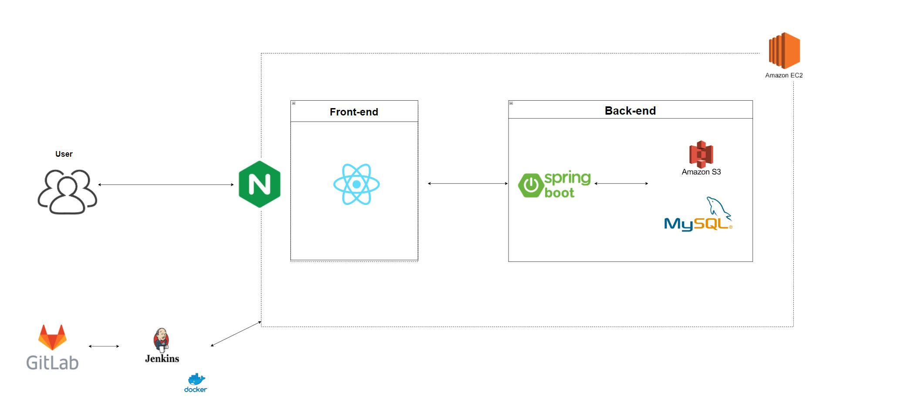
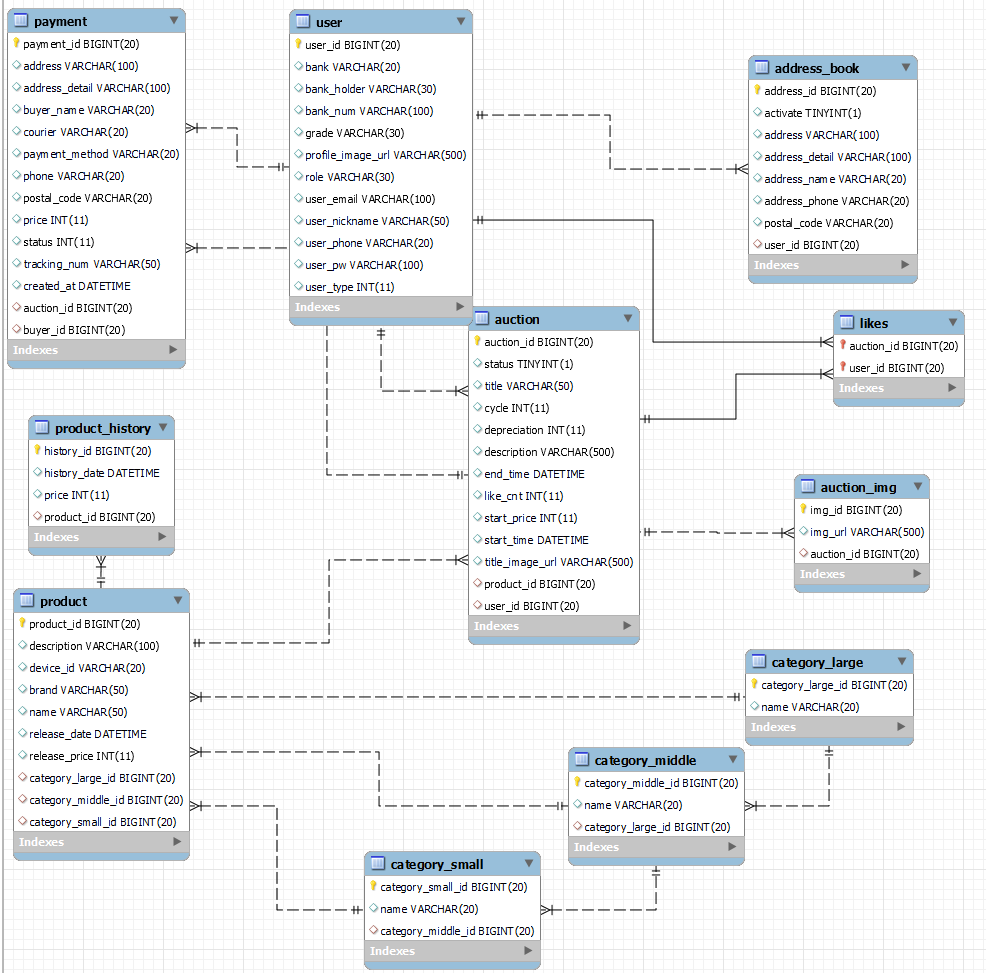

# 📉 가나다 마켓

**가**난한 **나**도 **다** 살 수 있는 **마켓**


## 📜 목차

- [서비스 소개](#서비스-소개)
  - [팀원 소개](#-팀원-소개)
  - [기술 스택](#-기술-스택)
- [프로젝트 폴더 구조](#ㅍ로젝트-폴더-구조)
- [산출물](#산출물)
  - [아키텍처](#-아키텍처)
  - [기능 명세서](#-기능-명세서)
  - [화면 설계](#-화면-설계)
  - [컨벤션](#-컨벤션)
  - [ERD](#-ERD)

- [결과물](#결과물)


## 👋서비스 소개
**가나다마켓은 미개봉 전자제품만을 거래하기 위한 플랫폼입니다.**

쉽고 빠른 거래를 위해 하향식 경매시스템을 도입하였습니다. 판매자는 판매 가격을 일일이 신경 쓸 필요가 없고, 구매자는 합리적인 가격에 제품을 구입할 수 있습니다.

하향식 경매방식의 중고 및 미개봉 전자제품 거래 플랫폼

- “가나다 마켓” 은 이런 분들을 위해 만들었어요.
  - 가지고 있었던 물건을 빠르게 정리하고 싶으신 분
  - 하향식 경매 시스템으로 값싸게 물건을 구하고 싶으신 분


## 📅 개발기간
- 2022.04.11 ~ 2022.05.20 (총 6주 )


## 😀 팀원 소개

```bash
🤔 조준영 : 팀장 / Frontend

😺 김민성 : Frontend / CI/CD

😮 김상희 : Backend

😁 김은준 : Backend / Tech Leader

😎 박창건 : Frontend

🥱 이홍준 : Frontend / Tech Leader
```


## 💻 기술 스택

```
**BackEnd** : Java(Zulu Open JDK 11), SpringBoot(Spring Boot 2.4.5), Gradle(7.4), 
					lombok, swagger(3.0.0), querydsl, jpa, jacoco
**FrontEnd**: React, TypeScript, Redux-toolkit, StoryBook, Emotion, Jest
**CI/CD** : Jenkins, Docker, Nginx, AWS EC2
**Test:** Jest, Storybook, JUnit
```


## 📁 폴더 구조

- **FE**

```bash
├─api
├─assets
├─components
│  ├─atoms
│  ├─layouts
│  ├─molecules
│  ├─organisms
│  └─templates
├─constants
├─functions
├─hooks
├─pages
├─state
│  ├─store.ts
│  └─reducers
├─stories
│  └─assets
├─styles
└─types
    ├─Entity
    └─Form
```

- **BE**

```bash
├─generated
├─java
│  └─com
│      └─marketganada
│          ├─api
│          │  ├─controller
│          │  ├─request
│          │  ├─response
│          │  └─service
│          ├─common
│          ├─config
│          │  ├─auth
│          │  └─oauth
│          └─db
│              ├─entity
│              └─repository
└─resources
```


## 💡 산출물

### 🚧 아키텍처





### 📝 기능 명세서

[Google Sheets - create and edit spreadsheets online, for free.](https://docs.google.com/spreadsheets/d/1W7UeY-xeRbIqElNUw15ps2ImVIPndoqjrQ9TsLd4tao/edit#gid=0)


### 🖥️ 화면 설계
[가나다마켓](https://www.figma.com/file/HbfYDebTup8DhdqKKp5AhO/가나다마켓?node-id=0%3A1)


### ♐ 컨벤션
- [Git 컨벤션](https://www.notion.so/Git-6e5ca54945f5452e8d5b69e412839fff)
- [프론트엔드 코드 컨벤션](https://www.notion.so/efbc0d2ce5d64d3084326186dfc04795)
- [백엔드 코드 컨벤션](https://www.notion.so/1aaaa7d5738b465bb8ac8c1ac472060e)
- [Jira 컨벤션](https://www.notion.so/Jira-b005810c002942e8b4751c52cb909c86)


### 💿 ERD




## 결과물
- [포팅메뉴얼](./exec/포팅메뉴얼.md)
- [시연시나리오](./exec/시연시나리오.md)

- [UCC](https://youtu.be/mXXHsJHjoXE)