- [메인 페이지](#[메인-페이지])
- [상세 페이지](#[상세-페이지])
- [조회 페이지](#[조회-페이지])
- [결제 페이지](#[결제-페이지])
- [마이 페이지](#[마이-페이지])
  - [구매, 판매 탭](#-[구매,-판매-탭])
  - [관심 상품 조회 탭](#-[관심-상품-조회-탭])
  - [판매 중 탭](#-[판매-중--탭])
  - [프로필 정보 탭](#-[프로필-정보-탭])
  - [주소록 탭](#-[주소록-탭])
  - [판매 정산 계좌 탭](#-[판매-정산-계좌-탭])

### [메인 페이지]

- 가장 최근에 올라온 경매 정보를 볼 수 있습니다.

  

### [상세 페이지]

- 구매하기 클릭시 결제 페이지 이동

- 관심상품 클릭시 관심 상품으로 등록할 수 있습니다.

- 상품의 기본 정보, 현재 가격, 다음 가격을 볼 수 있습니다.

- 해당 상품의 최근 거래 시세를 차트로 확인할 수 있습니다

  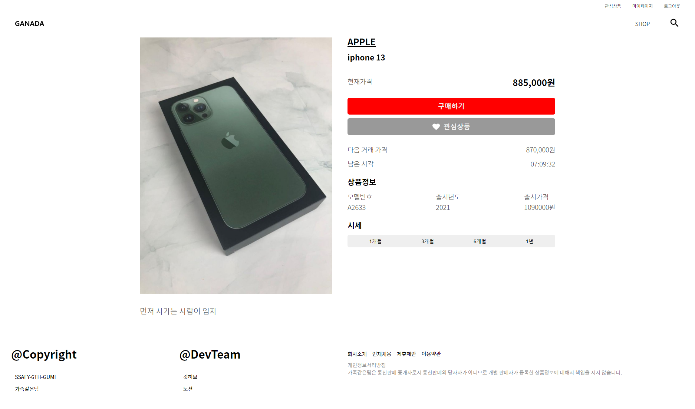

### [조회 페이지]

- 필터를 사용해 제품을 정렬할 수 있습니다.

- 무한 스크롤로 상품을 확인 할 수 있습니다.

- 로딩 스피너로 사용성을 높였습니다.

  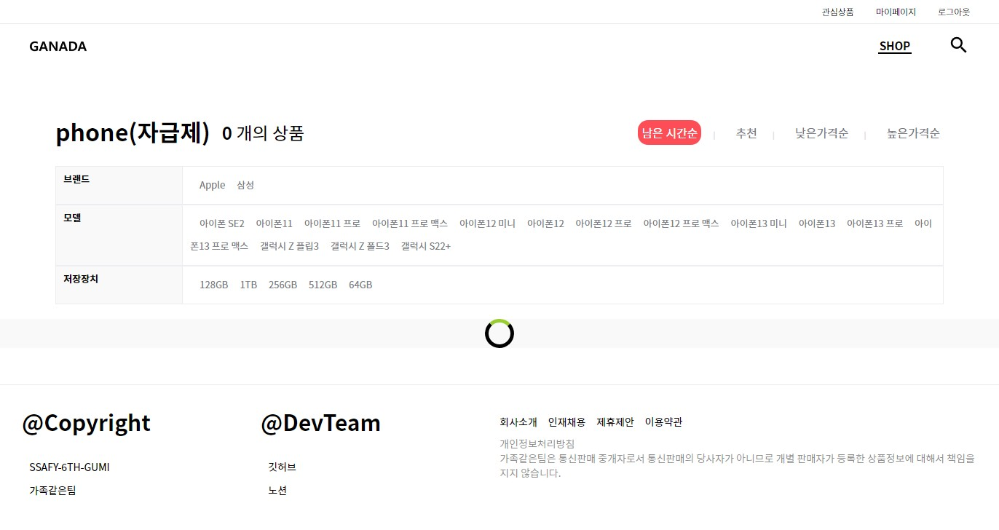

### [결제 페이지]

- 상품 정보, 배송지 선택, 주문 정보를 확인할 수 있습니다.

- 카카오 페이 테스트 결제를 할 수 있습니다.

  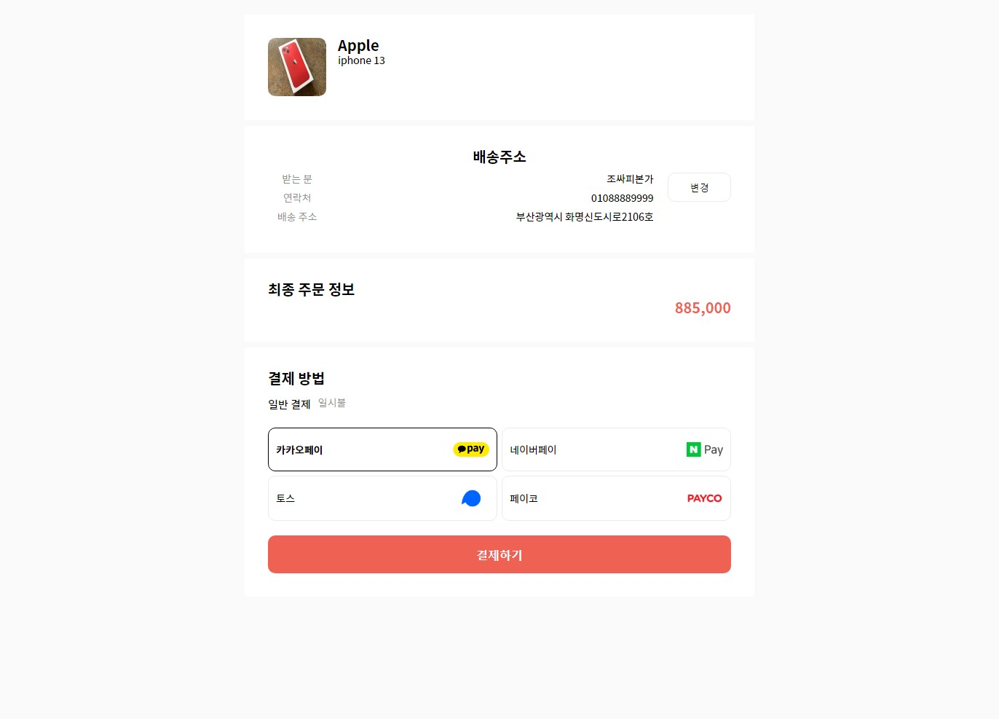

### [마이 페이지]

- 쇼핑 정보, 유저 정보의 하위 탭에서 정보를 확인할 수 있습니다.

- 프로필 정보를 등록, 수정할 수 있습니다.

#### [구매, 판매 탭]

- 구매, 판매 내역을 조회할 수 있습니다.

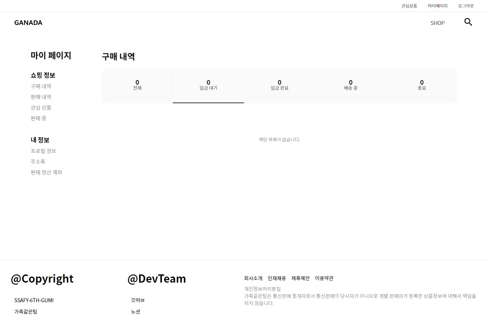

#### [관심 상품 조회 탭]

- 관심 상품을 조회할 수 있습니다.

  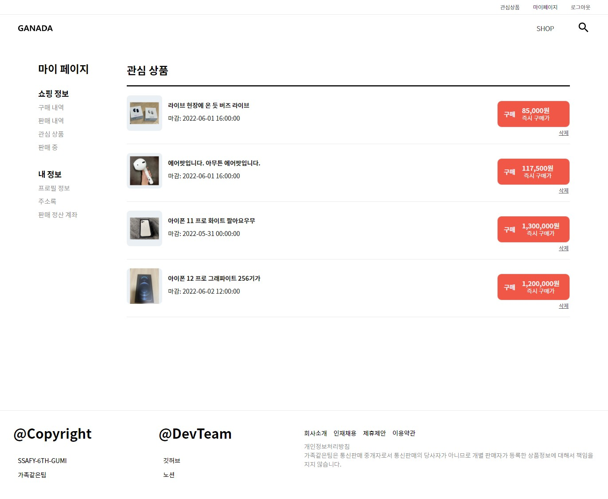

#### [판매 중 탭]

- 유저의 판매중인 상품을 조회할 수 있습니다.

  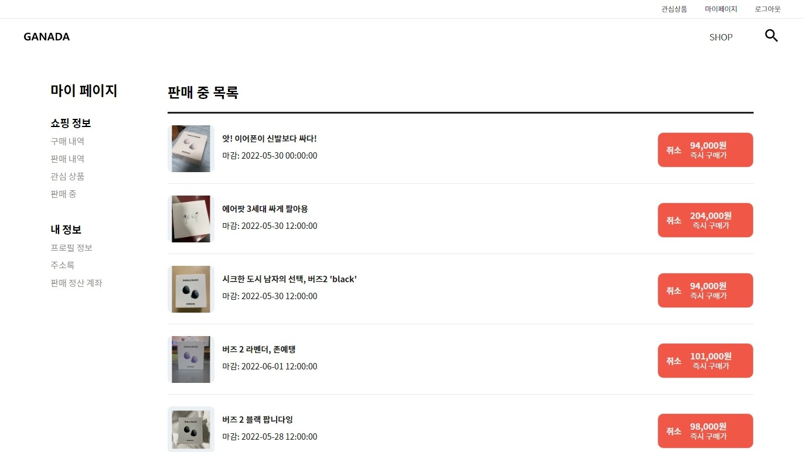

#### [프로필 정보 탭]

- 프로필 정보를 조회, 변경할 수 있습니다.

  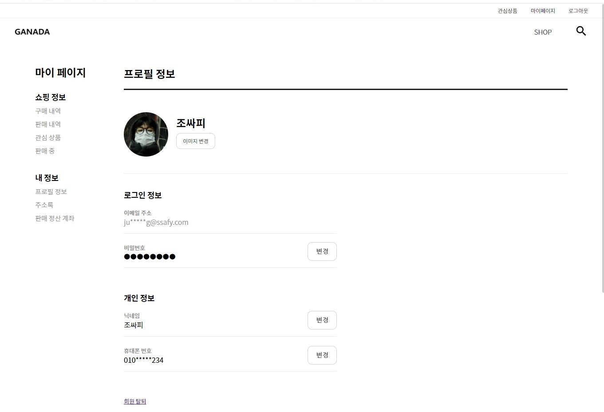

  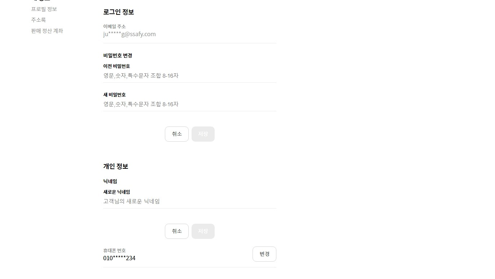

#### [주소록 탭]

- 주소록 등록, 삭제와 기본 배송지 설정을 할 수 있습니다.

  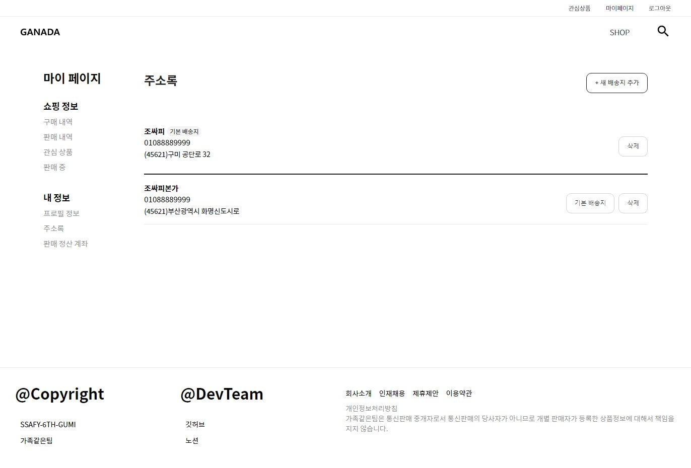

  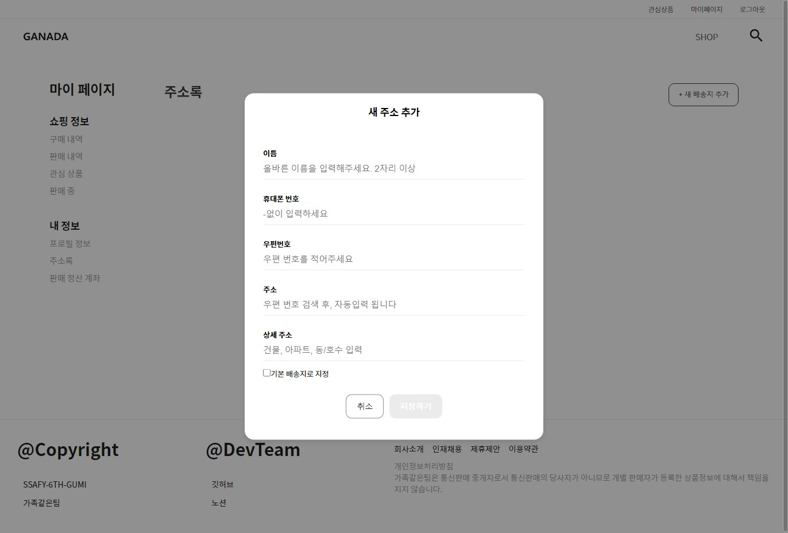

#### [판매 정산 계좌 탭]

- 계좌 정보를 등록, 수정할 수 있습니다.

  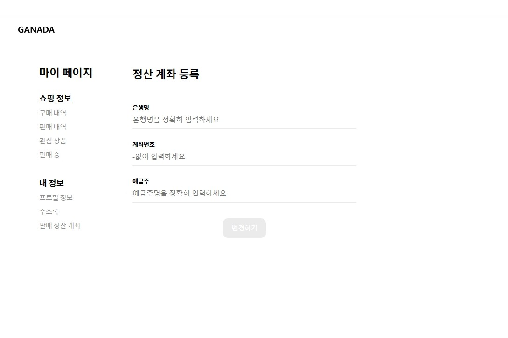

  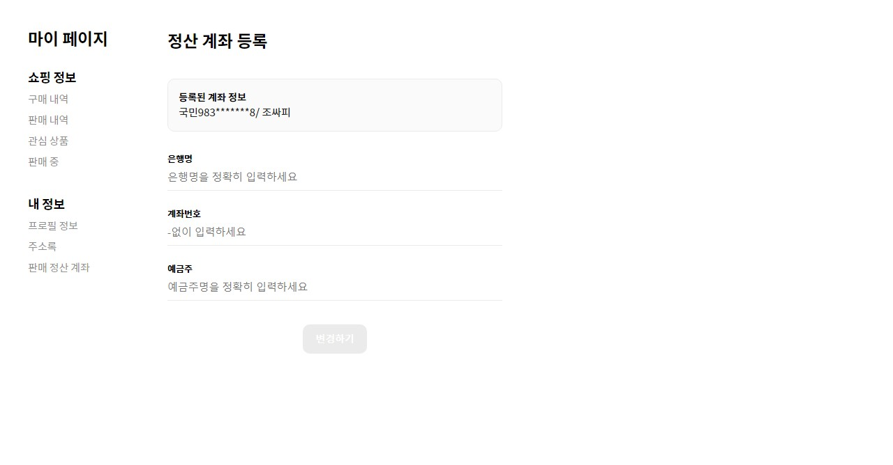
