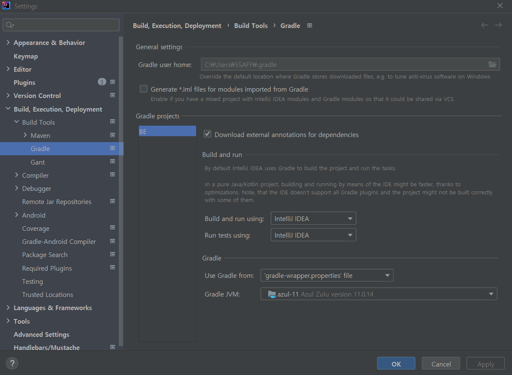
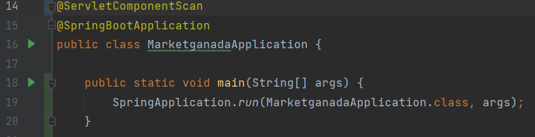

# 포팅 메뉴얼.md

#### 전체 레포지토리 클론

```bash
$git clone 'https://github.com/GANADA-FAMILY/GANADA-MARKET.git'
```


### Backend 빌드 (:8080)

1. Java 11(intellij 권장) 환경에서 gradle 실행

   `File > Settings > Build, Execution, Deployment > Build Tools > Gradle`
   
   

   

2. MarketganadaApplication.java 실행
   
	


### Front End 빌드 (:3000)

1. FE 폴더로 이동

   ```bash
   $cd FE
   ```

2. node_modules install

   ```bash
   $yarn install
   ```

3. yarn 

   ```bash
   $yarn start
   ```


## ⚡ Version

| Version 0.0.1 | 첫번째 릴리즈 |
| ------------- | ------------- |
|               |               |
|               |               |
|               |               |